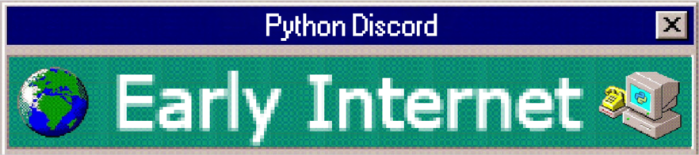
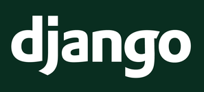
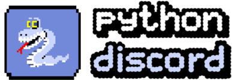

[][7]

### Welcome to Python Discord Summer Code Jam 2020!

#### The theme for this code jam is **Early Internet**.

What you do with this theme or how you interpret it is up to you, but it will be your task to come up with something fun using this theme.

#### The chosen technology for this game jam is [Django][6].

Django is a high-level Python Web framework that encourages rapid development and clean, pragmatic design. It comes "batteries included" with a slew of incredibly polished features, including database migrations, an excellent CRM, access control, security features to prevent you from making expensive mistakes, and [probably the best documentation on the internet][1].

#### We expect you to write a webapp.

Your project should be a webapp that can run in the browser. In order to do this, you'll need to use Django as your backend, and create some sort of frontend.

This may seem daunting at first, but please consider the following:
- We will only review your Python code. Your frontend code is not subject to review.
- You are welcome to make use of CSS frameworks, SPA frameworks with plug & play components, or any other tools that will do all the frontend visuals for you. We don't expect you to write CSS or JavaScript from scratch, and you will get no bonus points for doing so.

A very easy way to get a website looking good without having to write any "frontend code" is to use a CSS framework such as [Bulma], [Bootstrap], or [UIKit]. If you want to make it really simple, you can even use [django-simple-bulma], a PyPI package we've created to easily get Bulma running on your Django application.

These frameworks all have excellent documentation, and usually allow you to just copy paste elements you like from the documentation and into your application. **You do not need to be good at visual design or aesthetics in order to use these frameworks, it's really just programming.**

## Getting Started

### 1. Fork this repository

Start by [forking this repository][3]. If you're working as a team, only one person needs to do this.

### 2. Find your team folder in the repository

The repository should already contain a subdirectory named after your team. **All your project files must be contained within your team's subdirectory**. If you make any changes to files other than those in your team folder, we will not be able to merge your PR, and may have to disqualify your submission.

We are aware some CI/CD solutions require you to have configuration files/folders in the root of the repository; if you're using one of those, either try to use a unique name (e.g. prefix the configuration files with your team name) or remove the files/directories just before the end of the jam.

### 3. Study the guides and guidelines

We have written several documents that you should read through if you haven't done so already. These can all be accessed from the sidebar on [the main event page on our website][5]. The most important pages to work through can be found here:

- [Rules]
- [Judging]

### 4. Create a pull request

Open a pull request from your fork's `master` to the `master` branch of this repository in order to submit your project. **You should use the name of your team as the name of the pull request.** Please open you Pull Request at the start of the jam and ensure that the "Allow edits by maintainers" option is enabled. 

### 5. Commit to your master branch

The pull request you created will be automatically updated whenever you push code to `master` on your fork, so you can create the pull request whenever you want, and you only have to do it once. You do not need to wait until the very end of the game jam before you do it. Just keep pushing code to your `master` branch and do your best to finish before the game jam ends!

If you are working as a team, you should consider learning about feature branches so that you don't all work directly on the `master` branch and cause each other a bunch of conflicts. For a short explanation of how this works, see [this video][2].

### 6. Lint your code

We will be running a [linter] called [flake8] on all the code submitted to us in your Pull Request. This will find style problems and errors in your code and leave automatic review comments on your pull request. **We highly recommend that you set up a linter locally and lint your code as you go**, to prevent your pull request absolutely drowning in linting comments.

You can use a tool called [pre-commit] to easily set up automatic linting before every commit, so that you will not be able to commit code that is going to fail linting. Many IDEs (like [PyCharm] and [Visual Studio Code]) will also lint your code as you type it.

Our max-line-length is set to 119 characters.

## Useful Information for Participants

Here are some pages that may help you get started:

- [How to use git](https://pythondiscord.com/pages/code-jams/using-git/)
- [Making a fork, opening a pull request, & creating a GitHub webhook](https://pythondiscord.com/pages/code-jams/pull-request/)
- [Event page][5]
- [Rules]
- [Judging]
- [Django documentation][1]

## Things to keep in mind

### Your project should be easy to set-up
You should make sure your project is easy to set up for us, the reviewers. Ideally, it should not take us more than a few steps to get your project up and running, and those steps should be well-documented in your project’s README file. Consider using dependency management tools, like `pipenv` and `npm`, to make installing the dependencies of your projects as easy as possible. We would also encourage you to use `docker` and `docker-compose` to containerize your project, but this isn't a requirement.

### All projects will be merged into this repository
Your project will be merged into this repository at the end of the jam. This means that your project will stay available after the jam ends and that you'll get contributions credits for this repository on your GitHub-account. Do keep in mind that this repository is licensed under the [MIT open source license], which means that all the code and assets you submit for the Code Jam should be compatible with that license. In addition, please make sure to provide credit to the source of all third-party assets, even if the license does not require you to do so. 

Please also make sure you follow the instructions in the [Getting Started](#getting-started) section. We can't merge Pull Requests that (would) create conflicts with the submissions of the other teams.

### Write a good README
Your project has to include documentation. At the very least, it should include instructions on how to set-up and run your projects, but keep in mind that a README is the first thing people typically see when they look at a project on GitHub. A good README includes a short description of the project, installation instructions, and often documents common usage of the application. Browse the team folders in the [Winter Code Jam 2020 repository][4] to get an idea of the kind of READMEs commonly included in Code Jam projects.

### The main language of your project should be English
As English is the only language the judges share, we require you to use English as the main language for your project. This means that your variable names, code comments, `git` commit messages, and documentation should all be in English. The text displayed in your web application should also be in English, although you are allowed to provide the user with options for internationalization and translation.

## Partners

[][6] [][7] 

[1]: https://docs.djangoproject.com/en/3.0/
[2]: https://www.youtube.com/watch?v=j7YDbrS9I48
[3]: https://github.com/python-discord/summer-code-jam-2020/fork
[4]: https://github.com/python-discord/code-jam-6
[5]: https://pythondiscord.com/pages/code-jams/code-jam-7/
[6]: https://www.djangoproject.com/
[7]: https://pythondiscord.com
[Bulma]: https://bulma.io/
[Bootstrap]: https://getbootstrap.com/
[UIKit]: https://getuikit.com/
[django-simple-bulma]: https://github.com/python-discord/django-simple-bulma
[Rules]: https://pythondiscord.com/pages/code-jams/code-jam-7/rules/
[Judging]: https://pythondiscord.com/pages/code-jams/judging/
[linter]: https://realpython.com/python-code-quality/#linters
[flake8]: https://flake8.pycqa.org/en/latest/
[pre-commit]: https://pre-commit.com/
[PyCharm]: https://www.jetbrains.com/pycharm/
[Visual Studio Code]: https://code.visualstudio.com/
[MIT open source license]: https://opensource.org/licenses/MIT
