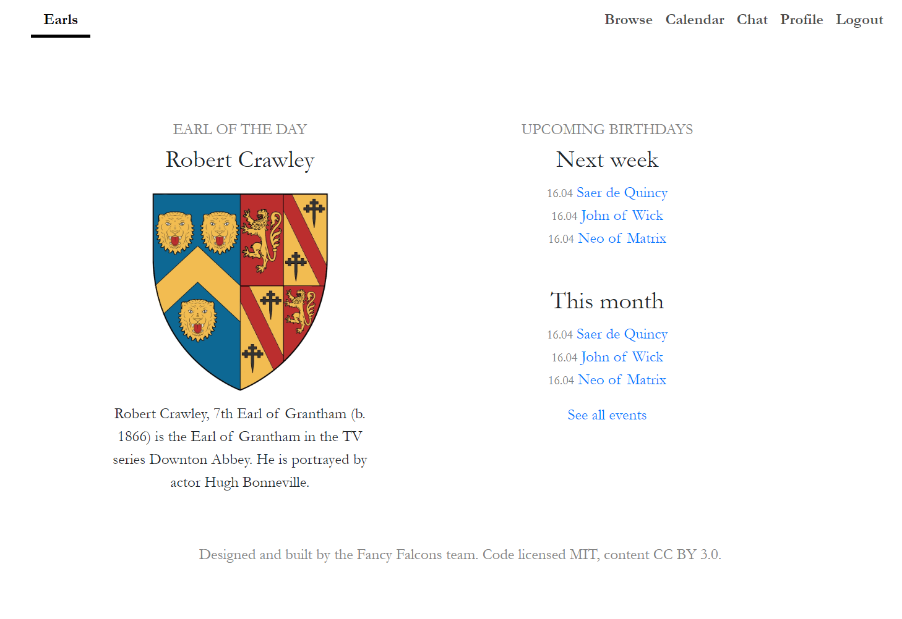
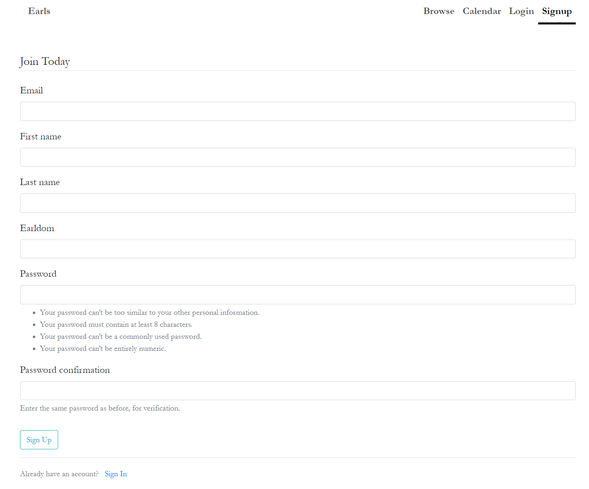
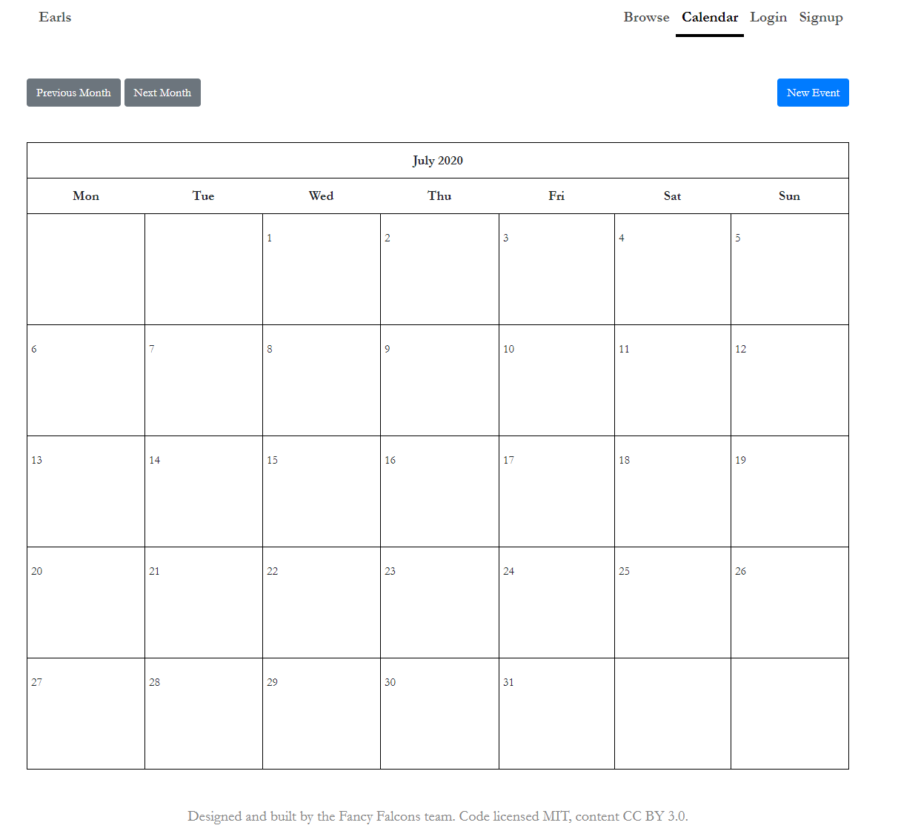
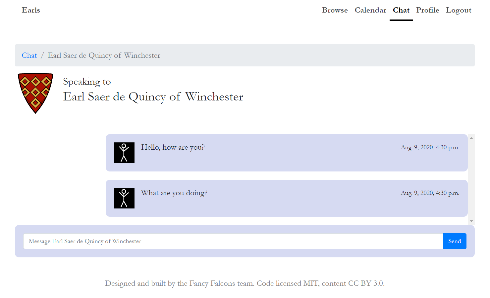

# Fancy Falcons

The Earl(y) Internet, a community for people with the title "Earl".

This website uses Python 3.8 and Django 3.0.9

## Pipenv setup guide - Ubuntu/GitBash terminal
1. Create a local copy of this repository
2. Make sure pipenv is installed, if not: _sudo apt-get install pipenv_
3. Go into our team folder: _cd summer-code-jam-2020/fancy-falcons/_
4. Sync the pipenv environment (within 'fancy-falcons' folder): _pipenv sync_
5. Start the pipenv shell: _pipenv shell_
6. Go into the django project folder: _cd fancy-falcons-proj_
7. Migrate: _python3 manage.py migrate --run-syncdb_
8. Load data: _python3 manage.py loaddata base_users.json_
9. Start the server: _python3 manage.py runserver_
10. You're good to go, open your browser an go to _localhost:8000_

# Site setup

## Homepage

## Registration from

## Event calendar

## Chat function

# Licence
All code is licenced under the MIT licence.

The information about Earls is pulled from Wikipedia and licenced under the [Creative Commons Attribution-ShareAlike License](https://en.wikipedia.org/wiki/Wikipedia:Text_of_Creative_Commons_Attribution-ShareAlike_3.0_Unported_License) (CC BY-SA 3.0)
