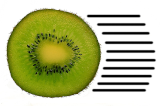

# Kinetic Kiwis

This is the default README of your team's project. Please replace this by a README with more information on your project. At the very least, your README should contain information on how to set-up and run your project.
