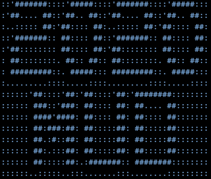

# Oscillating Oysters - TwentyTwentyMUD

You have gone back in time to the beginnings of the internet. Can you find
your way back to 2020 with your friends? Or, will you stay in the past
forever because things were cooler back then?

## Installation

Quickstart (on Linux):
```
cd twentytwentymud/
./QUICKSTART.sh
```
Or, run these commands. Using `docker-compose`, this will simply migrate, load fixtures, and start. 
```
docker-compose run --rm web python manage.py migrate
docker-compose run --rm web python manage.py loaddata MUD user
docker-compose up
```
The app should be running on localhost:8000 (or whatever ip docker is setup for).
Two users have already been created (username:password):
```
root:root
oyster:oysteroyster
```
New users can also be created from the login. Network play works and can be
tested by logging in a second user in an incognito window.

### Dedicated Server

A server may or may not be up and running during judging. Visit
http://yuriyyashkir.com:8000/mud/ to try it. May or may not be reset/crash
radomly.

## Gameplay

Type `help` for a list of commands. You can move with `go ROOM` or `go NUMBER`.
Use `say MESSAGE` or `send MESSAGE` to talk to others. Some commands may be
hidden.

## Notes

Extras used:
- xterm.js (front-end terminal)
- ansiwrap (wrapping colored text in terminal)
- channels (sockets, etc.)

Other useful commands:
```
docker-compose run --rm web python manage.py createsuperuser
docker-compose up -d
```

## Credits
- SpaceMono-Regular.ttf: Copyright 2016 Google Inc. All Rights Reserved.
- SpaceMono-Bold.ttf: Copyright 2016 Google Inc. All Rights Reserved.
