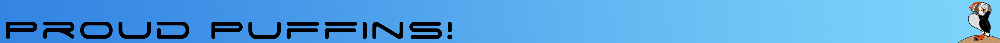

# Proud Puffins

Our take on the topic of early internet was to make a dating website, that was so 90's you probably threw up a little in your mouth. So ninties that you partied like it was 1999. We tried to add as much early internet obnoxiousnesses to it, to really make you love the 2020's, even with Covid around. Features such as in browser music, colored scroll bars, marquee text and of course Fabio. Unfortunately we won't get credit for any of it, because it was all hard coded in HTML. However, the part of the site that is Djangos back end is a system for matching you to the love of your life, albeit a fake love interest. Like, Dislike your way into the hearts of those you might never get to see in real life. We hope you enjoy.

We be Puffins, and we be proud!
* ergomacros
* ImaMoonky
* PDXCardinal78
* XPOjabar
* rr

## Loading the App
- Download or pull a clone of this directory.
- Create a virtual environment using the tools you like best.
- In the terminal cd in the the directory djangoProjects. This should be the location of the manage.py file.
- Run ```python puffin_setup.py```
- This should make all your migrations, pre load the database with data and start your server.
- Open your favorite browser to 127.0.0.1 to launch app.
- IF you have issues running this, then follow the instructions outlined in the Dev Stuff below.

## Dev stuff

### [Populating profiles database](https://docs.djangoproject.com/en/3.0/howto/initial-data/)
- Add new entries into `earlydating/fixtures/profiles.json`
- Run ```python3 manage.py makemigrations```
- Run ```python3 manage.py migrate```
- Run ```python3 manage.py loaddata users.json```
- Run ```python3 manage.py loaddata profiles.json``` (First users.json then profiles.json)
- Run server :)


### Code organisation

- Dev dependencies go in `requirements-dev.txt`
- Normal dependencies go in `requirements.txt`


## [MIT license](../LICENSE)

## [Credits and sources](Credits%20and%20sources.md)

