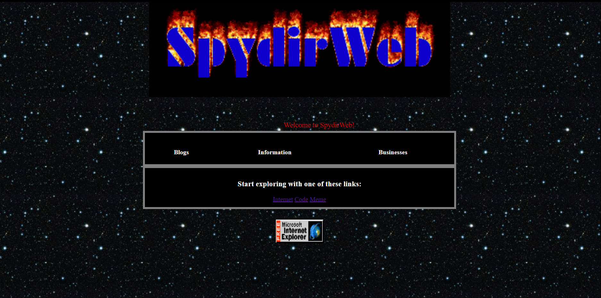
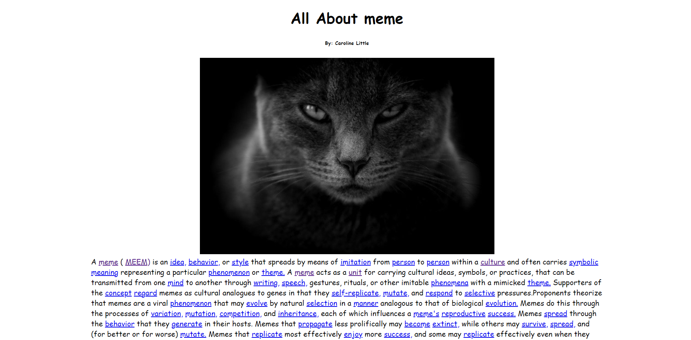
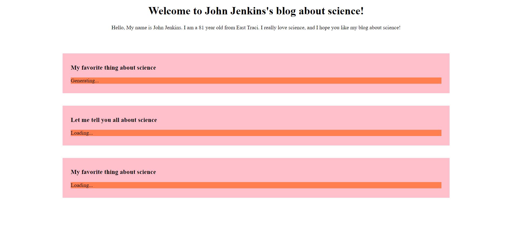

# Spydirweb

  

    
    
    

Blast off to the past and surf the web 90s style! With Spydirweb, you can browse a realistic version of the early internet! Get lost in hundreds of webpages, all generated with AI text generation, webscraping, and more! 

### Table of Contents
  * [Installation](#installation)
  * [Overview](#overview)
  * [License](#license)
  * [Authors](#Authors)

### Installation

Please message the team for the .env file.

### Overview

**SpydirWeb** has three different types of pages: information pages, blog pages, and business pages. The blog and business pages use [openai's gpt-2](https://github.com/openai/gpt-2) AI to generate the content, while the info pages use the [wikipedia](https://pypi.org/project/wikipedia/) package. Images are gotten using the [Pixabay API](https://pixabay.com/api/docs/).

Click one of the three links listed on the home page to get started browsing Spydirweb.

Click any underlined link to continue browsing.

The text in the blog and business pages may take a while to load, as they are generated with an AI.

And thats it. Have fun browsing!

 
### License

### Authors

(Made by neon, a helper on the <a href="https://pythondiscord.com/">Python Discord Server</a> using <a href="https://logomakrcom">logomakr</a>)

